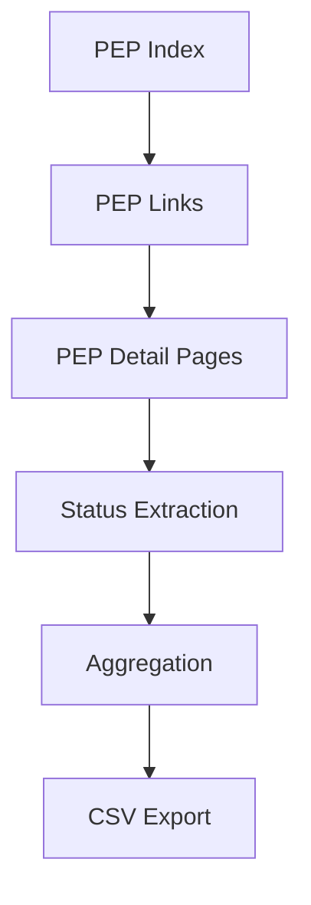
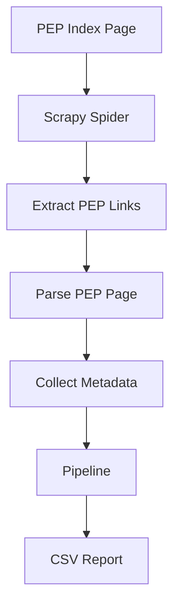

# Проект парсинга pep
## Особенности проекта

- асинхронный обход страниц с использованием Scrapy;
- извлечение данных через XPath и CSS-селекторы;
- агрегация статистики по статусам PEP;
- формирование CSV-отчетов;
- проверка согласованности данных между реестром PEP и страницами отдельных документов;
- автоматическое сохранение результатов в каталог results/.

## Процесс сбора данных



## Архитектура


## Структура проекта

```text
scrapy_parser_pep/
├── pep_parse/
│   ├── spiders/
│   ├── pipelines.py
│   ├── middlewares.py
│   ├── settings.py
│   └── items.py
├── tests/
├── results/
└── README.md
```

# Установка. 
## Следуйте следующим команда для установки и развертывание проекта у себя локально 
### Клонировать репозиторий и перейти в него в командной строке:
```
git clone https://github.com/Sava151/scrapy_parser_pep.git
```
### Cоздать и активировать виртуальное окружение:
#### Рекомендуется использовать python 3.9
```
py -3.9 -m venv venv
```
```
source venv/Scripts/activate
```
#### Уточнение имеющихся версий python 
```
py -0
```
#### Уточнение версии по умолчанию
```
python --version 
```
### Установить зависимости из файла requirements.txt
```
pip install -r requirements.txt
```
### Запустить проект
```
cd scrapy_parser_pep/
```
### Запуск
```
 scrapy crawl pep
```
# Стек технологий 
## Версия Python 3.9
## Сторонние библиотеки
* Scrapy


### Об авторе
[Sava151](https://github.com/Sava151)
